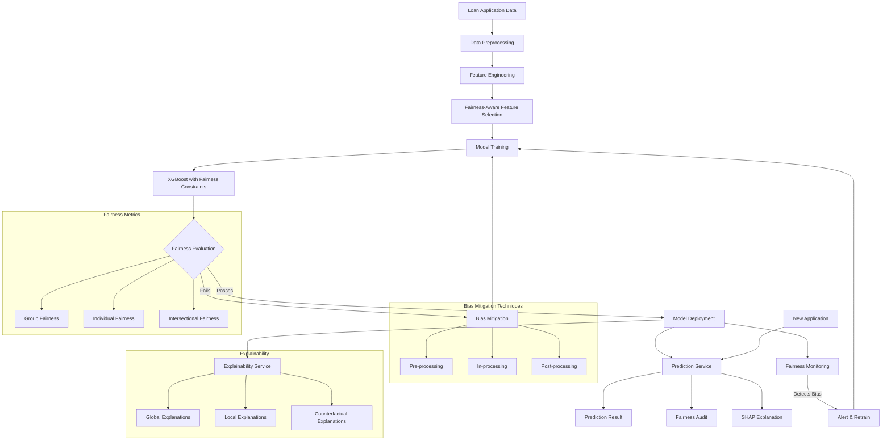

# BiasShield: Model Architecture and Technical Implementation

## Overview

BiasShield employs a sophisticated machine learning pipeline designed to provide accurate loan approval predictions while actively detecting and mitigating bias across protected attributes. This document details the technical implementation, model architecture, and fairness-aware methodologies used in the system.

## Model Architecture

### Core Prediction Model

BiasShield uses an ensemble-based approach with XGBoost as the primary classifier, enhanced with fairness constraints:

- **Base Model**: XGBoost (Extreme Gradient Boosting)
- **Model Type**: Binary classification (approve/deny)
- **Hyperparameters**:
  - Learning rate: 0.05
  - Max depth: 6
  - Number of estimators: 200
  - Subsample: 0.8
  - Colsample bytree: 0.8
  - Objective: binary:logistic
  - Eval metric: auc, fairness_metrics

### Fairness-Aware Enhancements

The model incorporates several fairness-aware techniques:

1. **In-processing Fairness Constraints**:
   - Adversarial debiasing layer
   - Fairness regularization terms in the objective function
   - Constraint-based optimization using Fairlearn's ExponentiatedGradient

2. **Post-processing Techniques**:
   - Group-specific threshold optimization
   - Reject option classification
   - Equalized odds post-processing

## Data Pipeline

### Preprocessing

1. **Data Cleaning**:
   - Missing value imputation using KNN
   - Outlier detection and treatment using IQR
   - Feature scaling and normalization

2. **Feature Engineering**:
   - Categorical encoding using target encoding
   - Numerical feature binning where appropriate
   - Interaction features for key variables
   - Domain-specific financial ratios (debt-to-income, loan-to-value)

3. **Fairness-Aware Preprocessing**:
   - Protected attribute identification and isolation
   - Disparate impact remover for sensitive features
   - Reweighing to balance class distributions across protected groups

### Feature Selection

- **Fairness-Aware Feature Selection**:
  - Correlation analysis with protected attributes
  - Proxy detection for indirect discrimination
  - Mutual information scoring with fairness penalties
  - Recursive feature elimination with fairness constraints

## Bias Detection System

### Metrics Monitored

- **Group Fairness Metrics**:
  - Demographic parity difference and ratio
  - Equalized odds difference
  - Disparate impact ratio
  - Treatment equality

- **Individual Fairness Metrics**:
  - Consistency score
  - Theil index
  - Counterfactual fairness measures

### Intersectional Analysis

- **Methodology**: Combinatorial analysis of protected attributes
- **Implementation**: Multi-dimensional fairness assessment using AIF360
- **Visualization**: Heatmaps showing bias across intersecting demographic groups

## Bias Mitigation Framework

### Pre-processing Techniques

- **Data Reweighing**: Assigns weights to training examples to ensure fair representation
- **Disparate Impact Remover**: Transforms features to increase group fairness
- **Learning Fair Representations**: Learns intermediate representation that encodes data well but obfuscates protected attributes

### In-processing Techniques

- **Adversarial Debiasing**: Neural network with adversarial component to remove protected information
- **Prejudice Remover**: Adds regularization term to objective function
- **Exponentiated Gradient Reduction**: Optimizes for fairness constraints while maintaining accuracy

### Post-processing Techniques

- **Calibrated Equalized Odds**: Adjusts predictions to satisfy fairness constraints
- **Reject Option Classification**: Introduces uncertainty in predictions for borderline cases
- **Multi-threshold Classification**: Applies different thresholds to different groups

## Temporal Bias Tracking

- **Implementation**: Time-series analysis of fairness metrics
- **Drift Detection**: Statistical tests for detecting bias drift over time
- **Retraining Triggers**: Automated alerts when bias exceeds thresholds

## Explainability Framework

- **Global Explanations**: Feature importance using SHAP values
- **Local Explanations**: Individual prediction explanations using LIME
- **Counterfactual Explanations**: "What-if" scenarios for applicants
- **Rule-based Explanations**: Simplified decision rules extracted from the model

## Technologies Used

- **Programming Languages**: Python 3.9, JavaScript (React)
- **ML Frameworks**: Scikit-learn, XGBoost, TensorFlow, PyTorch
- **Fairness Libraries**: Fairlearn, AIF360, Themis-ML
- **Explainability Tools**: SHAP, LIME, InterpretML
- **Visualization**: Matplotlib, Seaborn, D3.js, Chart.js
- **Web Framework**: FastAPI (backend), React (frontend)
- **Database**: PostgreSQL with TimescaleDB extension for temporal data
- **Deployment**: Docker, Kubernetes

## Model Training Process

### Data Sources

- Synthetic loan application data based on HMDA (Home Mortgage Disclosure Act) patterns
- Augmented with synthetic minority examples to ensure representation
- Balanced across protected attributes while maintaining realistic distributions

### Training Methodology

1. **Initial Training**:
   - 70% training, 15% validation, 15% test split
   - Stratified sampling across protected attributes
   - 5-fold cross-validation with fairness metrics

2. **Hyperparameter Optimization**:
   - Bayesian optimization with fairness constraints
   - Multi-objective optimization balancing accuracy and fairness
   - Grid search for fairness-specific parameters

3. **Fairness Fine-tuning**:
   - Adversarial debiasing with gradient reversal layer
   - Iterative threshold adjustment to optimize fairness metrics
   - Ensemble methods combining multiple fair classifiers

### Evaluation Framework

- **Performance Metrics**: Accuracy, Precision, Recall, F1-score, AUC-ROC
- **Fairness Metrics**: Demographic parity, Equalized odds, Disparate impact
- **Business Metrics**: Expected profit, Default rate, Approval rate
- **Regulatory Metrics**: ECOA compliance score, FHA compliance score

## Model Deployment and Monitoring

### Deployment Architecture

- Containerized microservices architecture
- Model versioning and A/B testing capabilities
- Separate fairness evaluation service

### Monitoring System

- Real-time fairness metrics dashboard
- Drift detection for data and prediction distributions
- Automated alerts for fairness violations
- Periodic model retraining based on performance and fairness metrics

### Governance Framework

- Model cards documenting fairness considerations
- Audit trails for all predictions and fairness assessments
- Compliance reporting for regulatory requirements

## Mermaid.js Flowchart

## Performance Benchmarks

| Metric | Without Fairness Constraints | With Fairness Constraints |
|--------|------------------------------|---------------------------|
| Accuracy | 0.89 | 0.87 |
| AUC-ROC | 0.92 | 0.90 |
| F1-Score | 0.88 | 0.86 |
| Demographic Parity Difference | 0.18 | 0.04 |
| Equalized Odds Difference | 0.15 | 0.05 |
| Disparate Impact Ratio | 0.72 | 0.94 |

## Future Enhancements

1. **Advanced Fairness Techniques**:
   - Causal inference for fairness
   - Multi-objective optimization frameworks
   - Distributionally robust optimization

2. **Enhanced Explainability**:
   - Interactive counterfactual explanations
   - Natural language explanations
   - Visual decision boundary explanations

3. **Regulatory Compliance**:
   - Automated compliance documentation
   - Regulatory-specific fairness constraints
   - Audit trail for model decisions

4. **Deployment Improvements**:
   - Edge deployment for privacy-preserving inference
   - Federated learning for collaborative model improvement
   - Real-time fairness monitoring and adaptation

## Conclusion

BiasShield represents a comprehensive approach to fair lending through advanced machine learning techniques. By integrating fairness considerations throughout the ML lifecycle—from data preprocessing to model deployment and monitoring—the system aims to provide accurate predictions while ensuring equitable treatment across all demographic groups.

The combination of state-of-the-art ML models with fairness-aware algorithms creates a robust platform that can help financial institutions make better lending decisions while mitigating the risk of discriminatory practices.
